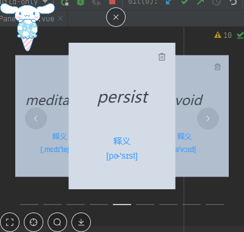
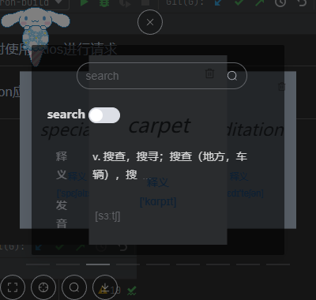
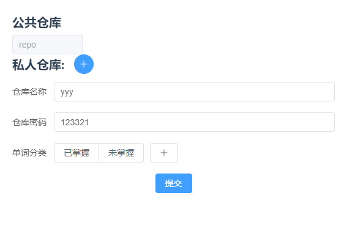
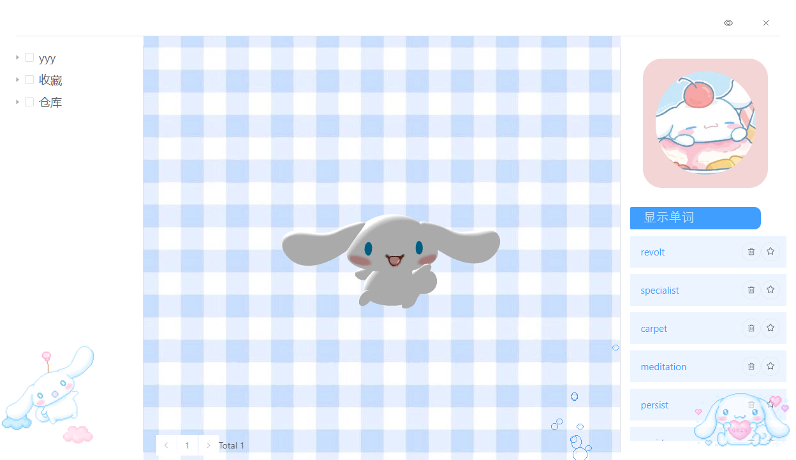
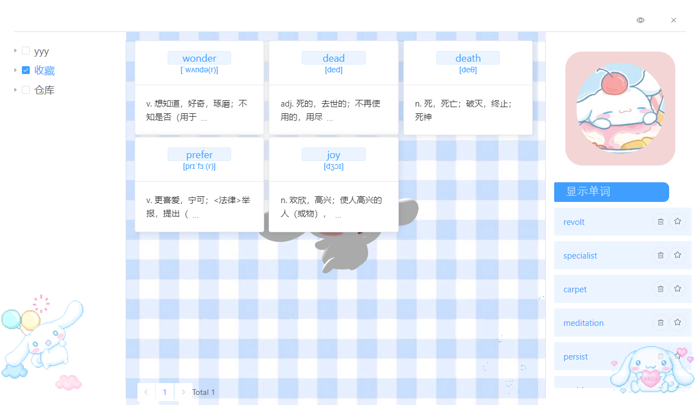

# 努力背单词
## 功能
这是一个帮助我们背单词的项目，包含了桌面小组件和配置页面和管理页面三个部分（目前
## 技术栈
使用的技术有如下部分

| 技术                   | 用途                                                                                  |
|----------------------|-------------------------------------------------------------------------------------|
| electron             | 构建可跨平台的桌面应用（基于windows，其他平台尚且未测试）                                                    |
| vite                 | 构建工具，比webpack更快（很新，bug存在不少，适配性一般）                                                   |
| vue                  | 前端框架，渐进式js框架，响应式，速度快，特性丰富，有丰富的ui库                                                   |
| element-ui           | 使用的组件库                                                                              |
| mongoose             | mongoDB的框架用于数据的存储                                                                   |
| pinia                | vue官方的状态共享库，比vuex好                                                                  |
| router               | 用于前端页面路由                                                                            |
| vue-3d-model         | 用于在前端页面快速便捷显示3d模型（本身是基于Three.js的封装）                                                 |
| vite-plugin-electron | 用于在测试和部署的时候将electron和vue结合起来，本身还有 vite-plugin-electron-renderer帮助我们配置渲染进程与主进程的IPC通信 |
| YAML                 | yaml作为配置文件                                                                          |
| axois                | 查词(查词时候使用了有道智慧云的api，当然也有很多数据没有利用到）时使用axios进行请求                                      |
| elctron-builder      | 用于electron应用的打包                                                                     |

## 效果图
### 主界面

### 设置界面

### 面板

## 缺陷
本身为了开发方便没有注意electron的安全问题,
还存在众多bug，只能简单使用，用户的信息并没有隔离，等于裸奔
## 计划
更新修复bug，重构不合理的代码部分，提高软件性能
